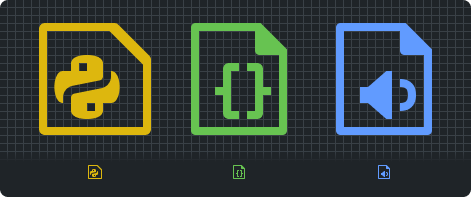

# Magpix

Pixel Perfect Icon Theme For Visual Studio Code

- [GitHub](https://github.com/Crawron/Magpix)
- [Suggestions and Issues](https://github.com/Crawron/Magpix/issues)

## Aligned to the pixel grid

All icons have been designed from the scratch in a 16px frame, to ensure they will look as sharp as possible.

## Licenses

Source code for this extension is licensed under MIT.

Graphic assets are licensed under the [Attribution-NonCommercial-ShareAlike 4.0 International](http://creativecommons.org/licenses/by-nc-sa/4.0/?ref=chooser-v1) Creative Commons license. Requiring payment for copies or derivatives (a paywall) is considered commercial use and not allowed.
